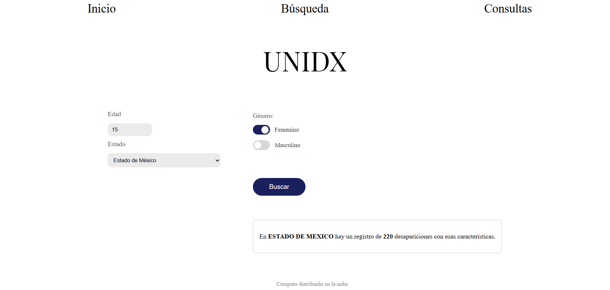
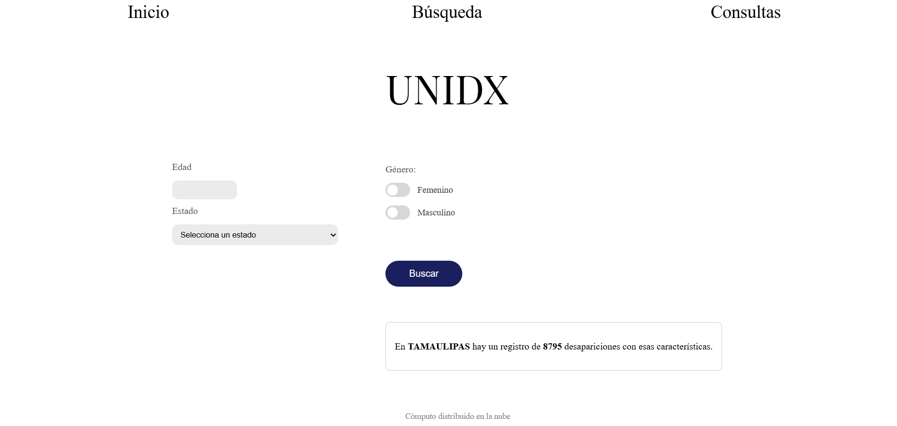
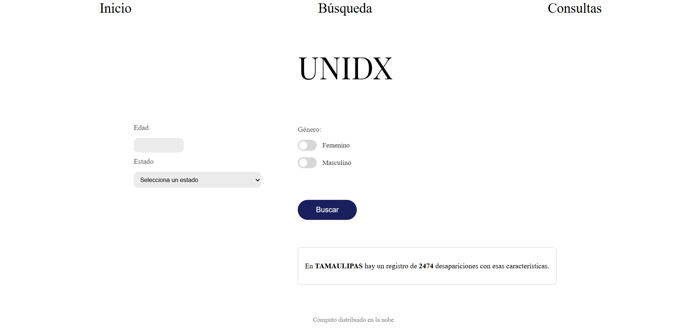

# UNIDAS
A service to count and consult missing persons cases in Mexico, searcheable by age, state and sex.


## Table of Contents
1. [Authors](#authors)
2. [Affiliations](#affiliations)
3. [Licence](#licence)
4. [Installation and Execution](#installation-and-execution)
5. [Introduction](#introduction)
6. [Justification](#justification)
7. [General objective](#general-objective)
8. [Specific objetives](#specific-objetives)
9. [Software tools](#software-tools)
10. [Architecture](#architecture)
11. [Methodology](#methodology)
12. [Implementation](#implementation)
13. [Tests](#tests)
14. [Results](#results)
15. [Conclusions](#conclusions)
16. [Bibliography](#bibliography)

## Authors
| Roles           | Name          | Contact                  |
|-----------------|---------------|--------------------------|
| Project lead    | Indra Cortes  | indracode7@gmail.com     |
| Testing lead    | Cristian Lopez| crl57m@comunidad.unam.mx |
| Technology lead | Jorge Bolaños | jorgehbr23@gmail.com     |

## Affiliations

[ENES Morelia, Universidad Nacional Autónoma de México](https://www.enesmorelia.unam.mx/)

## Licence
This project is licensed under the [GNU General Public License v3.0](https://www.gnu.org/licenses/gpl-3.0.en.html)

## Installation and Execution
### Requirements
- asgiref==3.11.1
- Django==6.0.5
- numpy==2.4.6
- pandas==3.0.3
- python-dateutil==2.9.0.post0
- six==1.17.0
- sqlparse==0.5.5
- typing_extensions==4.15.0

### Steps
```bash
# 1.Clone the repository
git clone https://github.com/SeCayoProduccion/Unidas.git
cd Unidas
 
# 2.Run the setup script. (It installs everything needed)
./EJECUTAME_PRIMERO.sh
```
The service will run at 'http://127.0.0.1:8000/ '

## Introduction
[UNIDAS](https://github.com/SeCayoProduccion/Unidas) was created to raise awareness about disappearances in Mexico by making this data accessible and understandable for everyone.

Data was sourced from the National Registry of Missing and Unlocated Persons (RNPDNO), made available by [Data Cívica](https://volveradesaparecer.datacivica.org/datos-abiertos).

## Justification
Thousands of people are reported missing in Mexico every year, yet the scale of this crisis is still difficult to grasp.
[UNIDAS](https://github.com/SeCayoProduccion/Unidas) was developed to make this reality more visible through an accessible interface in which cases can be filtered, allowing a bridge to be established between government data and the population.

# General objective
To develop a web service that allows users to consult the number of missing persons in Mexico filtered by age, state and sex, also keeping a record visitor queries.

## Specific objetives
1. Obtain and clean data from the RNPDNO public dataset.
2. Store the data as a CSV file.
3. Build a Django web application with a query interface.
4. Display the query results
5. Record and display a list of the visitors.

## Software tools
| Tool | Version | Use in the project |
|---|---|---|
| Django | 6.0.5 | Python web framework |
| pandas | 3.0.3 | Reads and filters the RNPDNO CSV file on each query (by state, sex, and age) |
| numpy | 2.4.6 | Installed as a dependency of pandas |
| python-dateutil | 2.9.0.post0 | Installed as a dependency of pandas |
| sqlparse | 0.5.5 | Used internally by Django |
| asgiref | 3.11.1 | Required by Django |
| six | 1.17.0 | Not used directly, compatibility dependency |
| typing_extensions | 4.15.0 | Not used directly, compatibility dependency |

## Architecture
- Acquisition: Data was sourced from the National Registry of Missing and Unlocated Persons (RNPDNO), made available by [Data Cívica](https://volveradesaparecer.datacivica.org/datos-abiertos)
- Storage: The RNPDNO dataset is stored as a CSV file and read on each query. Visitor records are stored in a SQLite database with django's orm.
- Processing:  Consults the data:

  1. Filters by age, state and sex.

  2. Displays the information.

  3. Keeps a record of the visitors.

- Publication: The results are published on a website interface.

## METHODOLOGY
The project was developed following a sequential pipeline:

1. Data acquisition: The RNPDNO dataset was downloaded from [Data Cívica](https://volveradesaparecer.datacivica.org/datos-abiertos) open data portal in a CSV format.
2. Data cleaning: The available csv was cleaned before use.
3. Data loading: The cleaned data was stored as a CSV file, which is read and filtered on each user query using pandas.
4. Interface development: A Django web application was built to expose a query form, filter the data, display results, and log visitor queries.

## IMPLEMENTATION
### Project structure
```
Unidas/
  .gitignore
  EJECUTAME_PRIMERO.sh # Installs dependencies and starts the server
  LICENSE
  README.md
  requirements.txt
  sqlite.ipynb # Script used to export data to SQLite
  imgs/
    tamaulipas_hombres.png
    tamaulipas_mujeres.png
  unidx/
    manage.py
    RNPDNO-22-08-2023-limpio.csv # Cleaned RNPDNO dataset
    core/
    plugin/ # Main Django app
      models.py # Visitante model
      views.py # Query, results and visitor log logic
      urls.py
      admin.py
      apps.py
      tests.py
      migrations/
      static/plugin/
        busqueda.css
        index.css
        negocio.css
        visitantes.css
      templates/plugin/
        index.html # Home page
        busqueda.html # Query form and results
        negocio.html
        visitantes.html # Visitor log
    unidx/ # Django project settings
      settings.py
      urls.py
      asgi.py
      wsgi.py
```

The setup script `EJECUTAME_PRIMERO.sh` creates the virtual environment, installs dependencies, runs migrations, and starts the development server.

The main view (`busqueda`) receives the user's state, sex, and optionally age via POST request. State and sex are required, age is optional. It reads the CSV with pandas, applies the filters, returns the total count of matching cases, and saves the search parameters and timestamp to the SQLite database.

## TESTS
| Test case | Input | Expected result | Status |
|---|---|---|---|
| State required | Sin estado seleccionado | Form does not submit | ✓ |
| Sex required | Sin género seleccionado | Form does not submit | ✓ |
| Age optional | Jalisco, Hombre | 3829 | ✓ |
| Filter by state, sex and age | Michoacán, Mujer, 15 | 64 | ✓ |
| No results | Oaxaca, Hombre, 99 | 0 | ✓ |

---

## RESULTS



The deployed service allows users to filter missing persons records by age, state and sex, returning a case count in real time. The visitor log correctly records each query with its timestamp.

Among the findings, Tamaulipas has highest number of recorded cases. Shows a notable gender asymmetry: 8675 male disappearances compared to 2474 female disappearances.

## CONCLUSIONS
Building this project introduced us to Django: models, views, urls, templates, and how all these connect to make a web service work. It was surprising how much goes on underneath something as simple as a search form. Choosing a topic we cared about made the project more engaging. Working with real disappearance data gave the technical work a sense of purpose beyond the classroom. This was a challenging but rewarding project that showed us what it actually takes to deploy a web service.

## BIBLIOGRAPHY
- Data Cívica. (2023). *Versión Pública del Registro Nacional de Personas Desaparecidas y No Localizadas (RNPDNO) formato csv* [Data set]. Comisión Nacional de Búsqueda. https://volveradesaparecer.datacivica.org/datos-abiertos
- Django Software Foundation. (2026). *Django documentation*. https://docs.djangoproject.com/